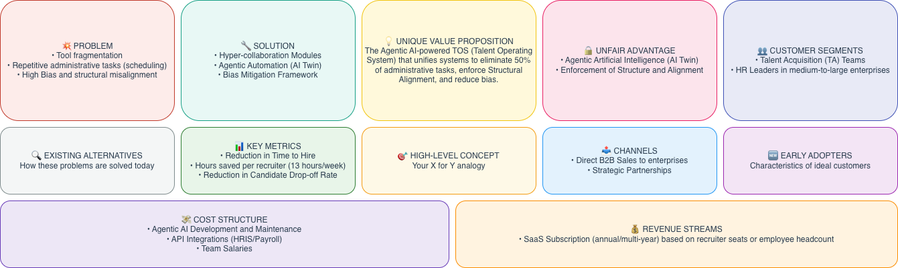
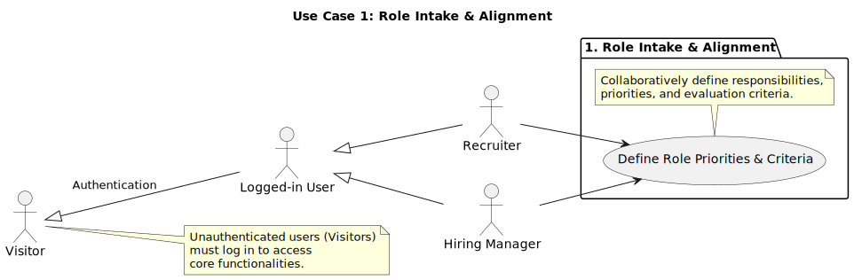
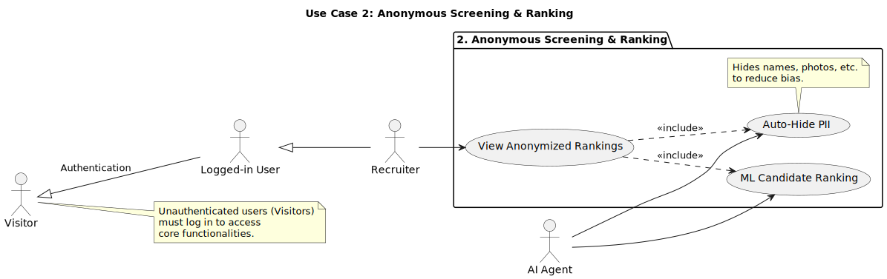
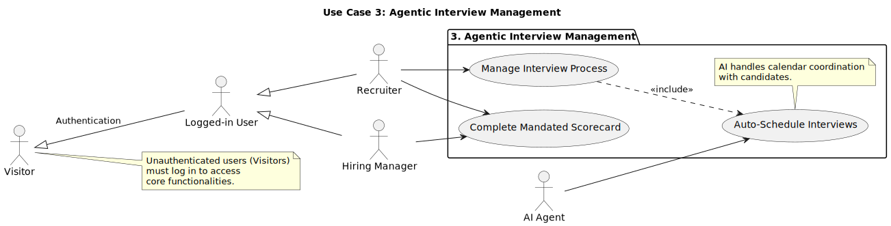
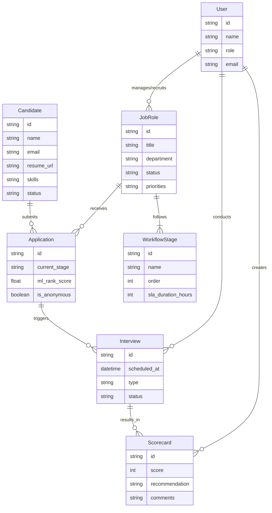
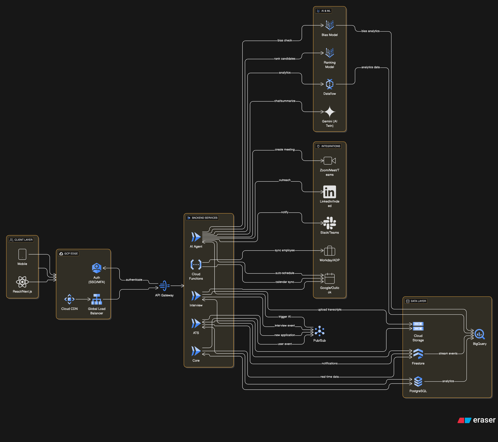
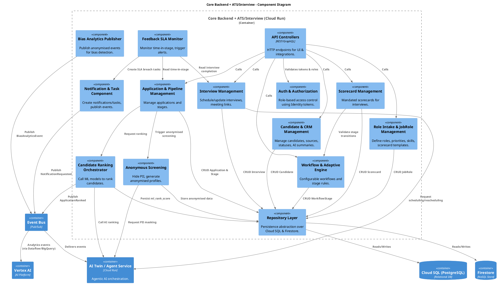

# LTI - Talent Operating System Design Document

## 1. Brief Description, Value, and Advantages

<!-- description.md -->

# Brief Description of the LTI Software (Talent Operating System)

LTI is conceived as a comprehensive **Talent Operating System (TOS)** that goes far beyond the basic capabilities of a traditional Applicant Tracking System (ATS). It unifies **ATS, CRM, sourcing, and post-hire onboarding** functionalities into a single, integrated platform.

The primary objective of LTI is to **eliminate repetitive administrative tasks** and **enforce structured workflows** in order to achieve **hyper-collaboration** and **reduce bias** across the entire talent lifecycle.

A key differentiator is its use of **Agentic Artificial Intelligence (Agentic AI)** to create **“AI Twins”**—proactive digital teammates that support recruiters and hiring managers in real time, acting as autonomous agents to handle complex, context-aware tasks.

---

## Market Value and Competitive Advantage

LTI’s value proposition is centered on transforming how customers calculate **Return on Investment (ROI)** by offering a **centralized, strategic solution** instead of a fragmented set of tools.

### ROI Drivers

Adopting LTI as a Talent Operating System generates significant ROI by:

1. **Eliminating point solutions**  
   LTI reduces IT complexity and infrastructure cost by integrating capabilities that typically require separate tools (e.g., interview scheduling software, niche CRMs).

2. **Reducing Total Cost of Ownership (TCO)**  
   By consolidating tools and removing integration overhead, LTI lowers the ongoing costs of maintaining multiple software solutions.

3. **Increasing productivity and revenue**  
   By filling positions faster, LTI directly contributes to revenue generation. Its automation capabilities can increase recruiter productivity by **up to 50%**.

---

## Key Competitive Advantages

LTI’s competitive edge lies in its ability to address the **core bottlenecks** of the hiring process:

- **Agentic AI (AI Twin)**  
  LTI deploys AI Twins that handle complex, context-aware tasks. This capability is a major differentiator.  
  The LTI Talent Agent is projected to save recruiters a **minimum of 13 hours per week** on non-strategic work, allowing them to focus on relationship-building and strategic initiatives.

- **Bias Mitigation Framework**  
  LTI provides both ethical and compliance advantages through **Anonymous CV Screening**, which hides personally identifiable information (PII) during the initial review phase.  
  This approach can reduce bias in candidate evaluation by **almost 47%**.

- **Enforcement of Structure and Alignment**  
  LTI enforces **structural alignment** between recruiters and hiring managers, addressing a structural misalignment that even leading ATS platforms often fail to solve.  
  This structure helps reduce candidate drop-off, given that **54% of candidates abandon processes due to poor communication**.

---

## Conceptual Summary

In essence, LTI acts as the **intelligent conductor of the hiring process**:

- Each **musician** (recruiter, hiring manager, candidate) is kept aligned.  
- The **instruments** (data and automation) are state-of-the-art.  
- The **score** (workflow) is followed rigorously.

The result is a **hiring performance that is smooth, objective, and fast**.

## 2. Main Functionalities

<!-- functionalities.md -->

# Main Functionalities and Feature Details

To fulfill the vision of a Talent Operating System that delivers efficiency, removes bias, and guarantees collaboration, LTI includes the following core functionalities.

---

## 1. Hypercollaboration and Structure

### 1.1 Role Intake Module

**Function**  
Ensures alignment from day one regarding **priorities, responsibilities, and evaluation criteria** for each role.

**Purpose for Success**  
Prevents the chaos and inconsistency of unstructured hiring processes, creating a shared understanding between recruiters and hiring managers from the outset.

---

### 1.2 Mandated Scorecards

**Function**  
Enforces **structured, competency-based interviews** using mandatory scorecards tailored to each role.

**Purpose for Success**  
Generates **objective and comparable data** across candidates, reducing unconscious bias and improving the quality and consistency of hiring decisions.

---

### 1.3 Feedback Service-Level Agreements (Feedback SLAs)

**Function**  
Monitors **“Time in Stage”** for each candidate and automatically **notifies hiring managers** to provide feedback within predefined timeframes (e.g., **24–48 hours**).

**Purpose for Success**  
Timely feedback is critical for the **candidate experience** and helps reduce process stagnation and candidate drop-off.

---

## 2. Agentic Automation (AI Twin)

### 2.1 AI-Powered Interview Scheduling Agent

**Function**  
Automates real-time **calendar coordination** for interviews, integrating with tools such as **Google Calendar** and **Outlook**, as well as existing recruitment systems.

**Purpose for Success**  
Saves recruiters **5–10 hours per week** and **accelerates time-to-hire** by eliminating back-and-forth scheduling.

---

### 2.2 Database Monitoring and Outreach

**Function**  
The **AI Twin continuously monitors the database of passive candidates** and alerts recruiters when contacts change jobs or trigger relevant events.

**Purpose for Success**  
Enables **timely re-engagement** with high-value talent and saves approximately **2 hours per week**, while improving pipeline activation and nurturing.

---

## 3. Intelligence and Bias Mitigation

### 3.1 Anonymous CV Screening

**Function**  
Automatically hides **personally identifiable information (PII)**—such as names and photos—during the initial screening phase.

**Purpose for Success**  
Forces evaluators to focus on **skills and experience**, significantly reducing the influence of demographic or appearance-based bias.

---

### 3.2 Machine Learning–Based Candidate Ranking

**Function**  
Uses **Machine Learning (ML)** to score and rank candidates based on **objective criteria and performance potential**, rather than on subjective preferences or the prestige of educational institutions.

**Purpose for Success**  
Improves **fairness and predictive quality** in hiring decisions, prioritizing candidates most likely to succeed in the role.

---

### 3.3 Organizational Bias Detection

**Function**  
Continuously monitors the **end-to-end hiring process** to detect **systemic exclusion patterns** (e.g., by demographics or age).

**Purpose for Success**  
Alerts HR leadership when a **review or correction** is needed, enabling data-driven interventions to improve diversity, equity, and inclusion.

---

## 4. Foundational Talent Operating System Capabilities

### 4.1 Seamless HRIS/Payroll Integration

**Function**  
Supports **API integrations** with leading HRIS and payroll platforms such as **Workday, ADP, and BambooHR**.

**Purpose for Success**  
Automates the transfer of data at the moment of hire, including:

- Automatic **employee ID generation**  
- Creation of **contract forms**  
- Setup of **payroll and compensation details**

This reduces manual errors, accelerates onboarding, and ensures data consistency across systems.

---

### 4.2 Adaptive Workflow Engine

**Function**  
Provides an **adaptive workflow engine** that enables HR teams to design **customizable, scalable workflows** with **conditional logic** applied consistently across the organization, not just per role.

**Purpose for Success**  
Ensures that best practices and compliance standards are **codified and enforced** across all hiring processes, supporting scalability and governance as the organization grows.

## 3. Lean Canvas

## 4. 3 Main Use Cases

# Main 3 Use Cases

Based on the core value propositions of **Structure**, **Bias Mitigation**, and **Agentic Automation**, here are the 3 main use cases that define the system's basic functionality:

## 1. Role Intake & Alignment (Structure)
**Why:** This addresses the "structural misalignment" bottleneck. It ensures that before any candidate is sourced, the recruiter and hiring manager are aligned on the role's priorities and evaluation criteria.
- **Key Features:** Collaborative definition of responsibilities, priorities, and "must-have" vs "nice-to-have" skills.

## 2. Anonymous Screening & Ranking (Bias Mitigation)
**Why:** This is a key competitive differentiator ("Bias Mitigation Framework"). It replaces subjective CV review with an objective, data-driven process.
- **Key Features:** Automated hiding of PII (names, photos) and ML-based ranking of candidates based on skills and potential.

## 3. Agentic Interview Management (Automation)
**Why:** This delivers the highest ROI in terms of time saved ("5-10 hours per week") and enforces the structured process.
- **Key Features:** AI "Twin" handles all scheduling logistics, while the system enforces the use of **Mandated Scorecards** during the actual interview to ensure objective data collection.

## 5. Data Model

<!-- data_model.md -->

# Essential Data Model Entities for LTI Talent Operating System

Based on the project definition, the following are the essential data model entities required to support the core functionalities of the LTI system (ATS, CRM, Sourcing, Onboarding).

## 1. Candidate
**Description:** Represents a potential hire. This is the central entity for the sourcing and CRM aspects.
**Key Attributes:**
- `id`: Unique identifier.
- `personal_info`: Name, email, phone, location (PII - potentially encrypted/masked).
- `resume_url`: Link to CV/Resume file.
- `skills`: List of skills/tags.
- `experience_years`: Total years of experience.
- `status`: Active, Passive, Blacklisted.
- `source`: Where the candidate came from (LinkedIn, Referral, Career Page).
- `ai_profile_summary`: Generated summary by AI Twin.

## 2. Job Role (Vacancy)
**Description:** Represents a job opening. Central to the "Role Intake" and "Structure" value propositions.
**Key Attributes:**
- `id`: Unique identifier.
- `title`: Job title.
- `department`: Department/Team.
- `hiring_manager_id`: Reference to User.
- `recruiter_id`: Reference to User.
- `status`: Draft, Open, Closed, On-Hold.
- `priorities`: List of key priorities for the role (Role Intake).
- `must_have_skills`: Mandatory requirements.
- `nice_to_have_skills`: Preferred requirements.
- `scorecard_template_id`: Reference to the evaluation criteria.

## 3. Application
**Description:** Represents a Candidate's specific application to a Job Role. Tracks the lifecycle.
**Key Attributes:**
- `id`: Unique identifier.
- `candidate_id`: Reference to Candidate.
- `job_role_id`: Reference to Job Role.
- `current_stage`: Applied, Screening, Interview, Offer, Hired, Rejected.
- `stage_entered_at`: Timestamp for SLA tracking ("Time in Stage").
- `ml_rank_score`: AI-generated ranking score (0-100).
- `is_anonymous`: Boolean to toggle PII visibility (Bias Mitigation).

## 4. User
**Description:** System users with specific roles and permissions.
**Key Attributes:**
- `id`: Unique identifier.
- `name`: Full name.
- `email`: Email address.
- `role`: Recruiter, Hiring Manager, Admin, Interviewer.
- `calendar_integration_token`: For AI scheduling (Google/Outlook).

## 5. Interview
**Description:** A scheduled interaction between a Candidate and Interviewer(s). Key for "Agentic Automation".
**Key Attributes:**
- `id`: Unique identifier.
- `application_id`: Reference to Application.
- `interviewer_ids`: List of Users conducting the interview.
- `scheduled_at`: Date and time.
- `status`: Scheduled, Completed, Cancelled, Rescheduled.
- `meeting_link`: URL for the virtual meeting.
- `type`: Screening, Technical, Cultural Fit, Final.

## 6. Scorecard (Evaluation)
**Description:** The structured feedback provided by an interviewer. Key for "Mandated Scorecards".
**Key Attributes:**
- `id`: Unique identifier.
- `interview_id`: Reference to Interview.
- `reviewer_id`: Reference to User.
- `scores`: Map of competency -> score (1-5).
- `comments`: Qualitative feedback.
- `overall_recommendation`: Strong Hire, Hire, No Hire, Strong No Hire.
- `submitted_at`: Timestamp.

## 7. Workflow / Pipeline Stage
**Description:** Defines the steps a candidate goes through for a specific job or globally.
**Key Attributes:**
- `id`: Unique identifier.
- `name`: Stage name (e.g., "Phone Screen").
- `order`: Sequence number.
- `sla_duration_hours`: Maximum time allowed in this stage (Feedback SLAs).
- `required_actions`: Actions needed to move to next stage (e.g., "Submit Scorecard").

## 8. Entity Relationship Diagram

## 6. High-Level System Design

<!-- high_level_design.md -->

# High-Level System Design (LTI on Google Cloud)

This document outlines the high-level architecture for the LTI Talent Operating System, leveraging **Google Cloud Platform (GCP)** to ensure scalability, security, and advanced AI capabilities.

## 1. Architecture Overview

The system follows a **Microservices Architecture** to ensure modularity and scalability, with a strong emphasis on **Event-Driven** patterns for asynchronous processing (AI tasks, notifications).

### Key Components

#### A. Frontend (Client Layer)
- **Web Application**: Built with React/Next.js.
- **Hosting**: **Firebase Hosting** (for fast content delivery) or **Cloud Run** (for SSR).
- **CDN**: **Cloud CDN** to cache static assets globally.

#### B. API Gateway & Security
- **API Gateway**: Manages API traffic, routing, and rate limiting.
- **Load Balancer**: **Global External HTTP(S) Load Balancer** for routing traffic to backend services.
- **Authentication**: **Identity Platform (Firebase Auth)** for secure user authentication (SSO, MFA).

#### C. Backend Services (Compute)
We will use **Cloud Run** (Serverless Containers) for the core application services. This allows for auto-scaling to zero and handling traffic spikes efficiently.
- **Core Service**: Manages Users, Job Roles, Organizations.
- **ATS Service**: Manages Applications, Pipelines, Workflows.
- **Interview Service**: Handles Scheduling (Calendar integrations) and Scorecards.
- **Integration Service**: **Cloud Functions** to handle webhooks and connectors with external HRIS (Workday, ADP).

#### D. Data Layer
- **Relational Database**: **Cloud SQL for PostgreSQL**. Stores structured data (Users, Jobs, Applications, relational integrity).
- **NoSQL / Real-time**: **Firestore**. Stores flexible data (Scorecards, Feedback forms) and powers real-time features (Notifications, Chat).
- **Object Storage**: **Cloud Storage**. Stores candidate resumes (PDFs), profile photos, and other unstructured media.

#### E. AI & Machine Learning (The "Brain")
- **Vertex AI**: The core platform for all AI operations.
    - **AutoML / Custom Models**: For Candidate Ranking and Bias Detection.
    - **Gemini API**: Powers the **AI Twin** (Chatbot, Auto-scheduling, Summarization).
- **Data Pipeline**: **Dataflow** for processing analytics data.
- **Data Warehouse**: **BigQuery** for storing historical data for "Organizational Bias Detection" and analytics.

#### F. Asynchronous Messaging
- **Pub/Sub**: Decouples services.
    - *Example*: When a candidate applies, an event is published. The "AI Ranking Service" subscribes to this to process the resume asynchronously.

## 2. Architecture Diagram

## 3. Design Decisions & Rationale

1.  **Cloud Run vs. Kubernetes (GKE)**:
    *   *Decision*: **Cloud Run**.
    *   *Rationale*: LTI is a startup. Cloud Run offers a lower operational overhead (serverless) while still using containers, allowing for easy migration to GKE later if complexity grows.

2.  **Cloud SQL (PostgreSQL)**:
    *   *Rationale*: The core data (Applications, Jobs) is highly relational and requires strong consistency. PostgreSQL is the industry standard.

3.  **Vertex AI**:
    *   *Rationale*: Provides a unified platform for both generative AI (Gemini for the "Twin") and predictive AI (Ranking/Bias), simplifying the ML Ops pipeline.

4.  **Pub/Sub**:
    *   *Rationale*: Critical for the "Agentic" nature. The AI agents need to react to events (e.g., "Candidate replied", "Interview finished") without blocking the main user flow.

## 4. Architectural Q&A & Key Considerations

### 1. User Roles & Workflows
*   **Recruiters**: Focus on high-level pipeline management and sourcing strategy. Their workflow is heavily supported by the **AI Twin** for scheduling and initial screening. They interact primarily with the **ATS Service** and **AI Agent** outputs.
*   **Hiring Managers**: Focus on **Role Intake** (defining requirements) and **Evaluation** (Scorecards). They interact with the **Core Service** (for role definition) and **Interview Service** (for feedback).
*   **Candidates**: Interact with the **Web Application** for applying and the **AI Twin** (via chat/email) for scheduling.
*   **Admins**: Manage system configuration, integrations, and view **Organizational Bias** analytics.

### 2. External Systems & Integrations
Beyond HRIS (Workday/ADP) and Calendars, the system requires:
*   **Video Conferencing (Zoom/Google Meet/Teams)**: Essential for the **AI Interview Agent** to generate meeting links dynamically.
*   **Sourcing Channels (LinkedIn/Indeed)**: For the **AI Twin** to monitor passive candidates and trigger outreach.
*   **Communication Platforms (Slack/Teams)**: For real-time notifications to Hiring Managers (e.g., "Feedback SLA" alerts).

### 3. AI-Driven Features Highlighted
The architecture explicitly isolates these features in the **Vertex AI** and **AI Agent Service** components:
*   **Candidate Ranking**: Handled by custom AutoML models triggered by application submission.
*   **Bias Detection**: Continuous monitoring model running on data in BigQuery/Firestore.
*   **Chatbot (AI Twin)**: Powered by **Gemini Pro**, managing candidate interaction.
*   **Auto-scheduling**: A logic flow within the AI Agent interacting with Calendar APIs.
*   **Summarization**: Gemini processing interview transcripts and resumes.

### 4. Diagram Focus
The provided architecture diagram focuses on **High-Level Service Interactions** and **Event-Driven Flows**.
*   *Why?* The complexity of LTI lies in the *orchestration* between standard CRUD operations (ATS) and autonomous agents.
*   *Detail*: We explicitly show the **Pub/Sub** event bus to demonstrate how the "AI Brain" is decoupled from the transactional core, ensuring that heavy AI processing doesn't slow down the user experience.

## 7. C4 Component Diagram (Core Backend + ATS/Interview)

