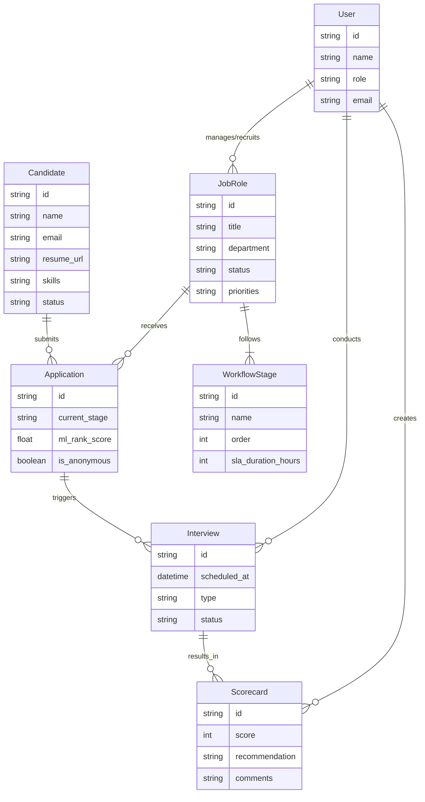

# Essential Data Model Entities for LTI Talent Operating System

Based on the project definition, the following are the essential data model entities required to support the core functionalities of the LTI system (ATS, CRM, Sourcing, Onboarding).

## 1. Candidate
**Description:** Represents a potential hire. This is the central entity for the sourcing and CRM aspects.
**Key Attributes:**
- `id`: Unique identifier.
- `personal_info`: Name, email, phone, location (PII - potentially encrypted/masked).
- `resume_url`: Link to CV/Resume file.
- `skills`: List of skills/tags.
- `experience_years`: Total years of experience.
- `status`: Active, Passive, Blacklisted.
- `source`: Where the candidate came from (LinkedIn, Referral, Career Page).
- `ai_profile_summary`: Generated summary by AI Twin.

## 2. Job Role (Vacancy)
**Description:** Represents a job opening. Central to the "Role Intake" and "Structure" value propositions.
**Key Attributes:**
- `id`: Unique identifier.
- `title`: Job title.
- `department`: Department/Team.
- `hiring_manager_id`: Reference to User.
- `recruiter_id`: Reference to User.
- `status`: Draft, Open, Closed, On-Hold.
- `priorities`: List of key priorities for the role (Role Intake).
- `must_have_skills`: Mandatory requirements.
- `nice_to_have_skills`: Preferred requirements.
- `scorecard_template_id`: Reference to the evaluation criteria.

## 3. Application
**Description:** Represents a Candidate's specific application to a Job Role. Tracks the lifecycle.
**Key Attributes:**
- `id`: Unique identifier.
- `candidate_id`: Reference to Candidate.
- `job_role_id`: Reference to Job Role.
- `current_stage`: Applied, Screening, Interview, Offer, Hired, Rejected.
- `stage_entered_at`: Timestamp for SLA tracking ("Time in Stage").
- `ml_rank_score`: AI-generated ranking score (0-100).
- `is_anonymous`: Boolean to toggle PII visibility (Bias Mitigation).

## 4. User
**Description:** System users with specific roles and permissions.
**Key Attributes:**
- `id`: Unique identifier.
- `name`: Full name.
- `email`: Email address.
- `role`: Recruiter, Hiring Manager, Admin, Interviewer.
- `calendar_integration_token`: For AI scheduling (Google/Outlook).

## 5. Interview
**Description:** A scheduled interaction between a Candidate and Interviewer(s). Key for "Agentic Automation".
**Key Attributes:**
- `id`: Unique identifier.
- `application_id`: Reference to Application.
- `interviewer_ids`: List of Users conducting the interview.
- `scheduled_at`: Date and time.
- `status`: Scheduled, Completed, Cancelled, Rescheduled.
- `meeting_link`: URL for the virtual meeting.
- `type`: Screening, Technical, Cultural Fit, Final.

## 6. Scorecard (Evaluation)
**Description:** The structured feedback provided by an interviewer. Key for "Mandated Scorecards".
**Key Attributes:**
- `id`: Unique identifier.
- `interview_id`: Reference to Interview.
- `reviewer_id`: Reference to User.
- `scores`: Map of competency -> score (1-5).
- `comments`: Qualitative feedback.
- `overall_recommendation`: Strong Hire, Hire, No Hire, Strong No Hire.
- `submitted_at`: Timestamp.

## 7. Workflow / Pipeline Stage
**Description:** Defines the steps a candidate goes through for a specific job or globally.
**Key Attributes:**
- `id`: Unique identifier.
- `name`: Stage name (e.g., "Phone Screen").
- `order`: Sequence number.
- `sla_duration_hours`: Maximum time allowed in this stage (Feedback SLAs).
- `required_actions`: Actions needed to move to next stage (e.g., "Submit Scorecard").

## 8. Entity Relationship Diagram

